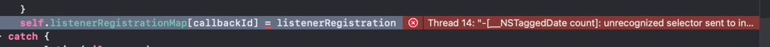

# Bug reproduction Repo
When setting up (multiple) snapshot listeners the iOS app crashes randomly with varying errors.

This reproduction application has been created through `npm create vite@latest my-app --template react` and then adding
`@capacitor/core`, `@capacitor/cli`, `@capacitor-firebase/firestore`, `@capacitor-firebase/app`, and `firebase`.

To reproduce the error:
1. `npm i`
2. `npm run build`
3. Replace `[your local IP]` inside the `capacitor.config.ts`
4. `npx cap sync`
5. Add firebase config as described in the docs: https://github.com/capawesome-team/capacitor-firebase/blob/main/docs/firebase-setup.md#ios
6. `npm run dev -- --host`
7. Start the app on any emulator or real device
8. Play arount with `numberOfSnapshotListeners` in `App.tsx`
9. Observe the error in XCode (file `@capacitor-firebase/firestore/ios/Plugin/FirebaseFirestore.swift`, e.g. )
